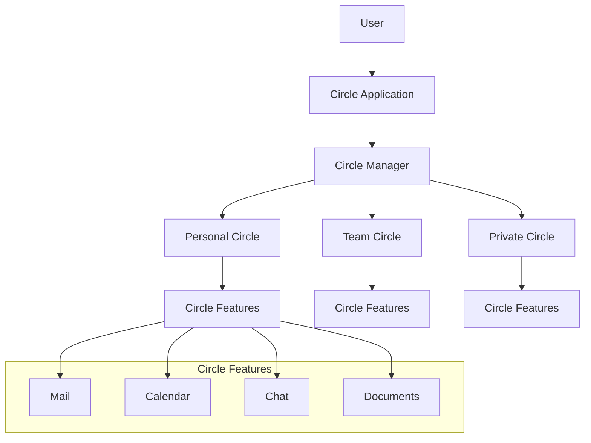
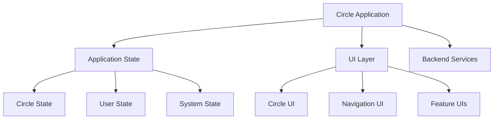
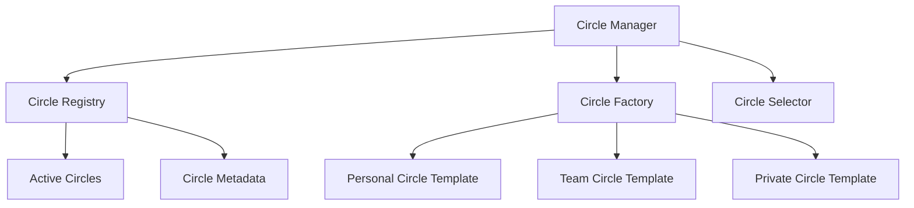
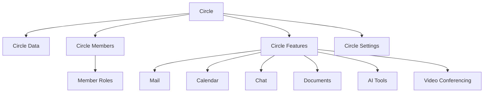
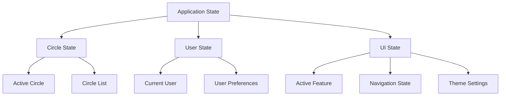
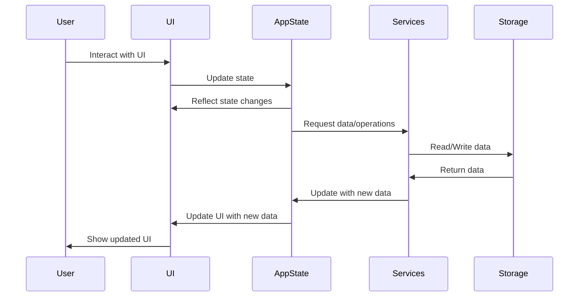

# Circle-Based Collaboration System: Architecture Design

Based on your requirements and the capabilities of egui, I'll create a high-level architecture design focusing primarily on the UI/UX architecture with less emphasis on backend components. This will serve as a foundation for implementing a modular system where users can connect to Circles and access various features like mail, calendar, documents, etc.

## 1. System Overview



## 2. Core Components

### 2.1 Application Layer

The main application will be built using egui and eframe (egui framework) to ensure cross-platform compatibility.



### 2.2 Circle Manager

The Circle Manager will handle the creation, management, and switching between different circles.



### 2.3 Circle Structure

Each Circle will have a consistent structure with access to the same set of features.



## 3. UI/UX Architecture

### 3.1 Main Application Layout

```
+-------------------------------------------------------+
|                     Top Navigation                    |
+---------------+-------------------------------------+
|               |                                     |
|               |                                     |
|  Circle       |                                     |
|  Selector     |        Feature Content Area         |
|               |                                     |
|               |                                     |
|               |                                     |
+---------------+-------------------------------------+
|                     Status Bar                      |
+-------------------------------------------------------+
```

### 3.2 Circle Selector UI

The Circle Selector will be a panel that allows users to:
- View all their circles
- Create new circles
- Switch between circles
- See circle notifications
- Manage circle settings

### 3.3 Feature Navigation

Within each circle, users will have a consistent navigation system to access different features:

```
+-------------------------------------------------------+
|                     Circle Name                       |
+-------------------------------------------------------+
| Mail | Calendar | Chat | Docs | AI | Video | Settings |
+-------------------------------------------------------+
|                                                       |
|                 Feature Content Area                  |
|                                                       |
+-------------------------------------------------------+
```

### 3.4 Feature UIs

Each feature will have its own specialized UI, but with consistent design patterns:

#### 3.4.1 Mail UI

```
+-------------------------------------------------------+
| New | Reply | Forward | Delete |       Search         |
+---------------+-------------------------------------+
|               |                                     |
|  Mail         |                                     |
|  Folders      |         Message Content             |
|               |                                     |
|  Inbox        |                                     |
|  Sent         |                                     |
|  Drafts       |                                     |
|  Trash        |                                     |
+---------------+-------------------------------------+
```

#### 3.4.2 Calendar UI

```
+-------------------------------------------------------+
| Day | Week | Month | New Event |     Search           |
+-------------------------------------------------------+
|                                                       |
|                                                       |
|                   Calendar View                       |
|                                                       |
|                                                       |
+---------------+-------------------------------------+
|  Upcoming     |                                     |
|  Events       |       Selected Event Details        |
|               |                                     |
+---------------+-------------------------------------+
```

#### 3.4.3 Chat UI

```
+-------------------------------------------------------+
| New Chat | New Group |                Search          |
+---------------+-------------------------------------+
|               |                                     |
|  Chat         |                                     |
|  List         |         Chat Messages               |
|               |                                     |
|               |                                     |
|               |                                     |
|               |                                     |
+---------------+-------------------------------------+
|               Message Input                         |
+-------------------------------------------------------+
```

#### 3.4.4 Documents UI

```
+-------------------------------------------------------+
| New | Upload | Share |                Search          |
+---------------+-------------------------------------+
|               |                                     |
|  Document     |                                     |
|  Folders      |         Document Content            |
|               |                                     |
|  Recent       |                                     |
|  Shared       |                                     |
|  Templates    |                                     |
|               |                                     |
+---------------+-------------------------------------+
```

## 4. Implementation Architecture

### 4.1 Code Structure

```
src/
├── main.rs                 # Application entry point
├── app.rs                  # Main application state and logic
├── ui/                     # UI components
│   ├── mod.rs
│   ├── app_ui.rs           # Main application UI
│   ├── circle_selector.rs  # Circle selection UI
│   └── features/           # Feature-specific UIs
│       ├── mod.rs
│       ├── mail.rs
│       ├── calendar.rs
│       ├── chat.rs
│       ├── documents.rs
│       ├── ai_tools.rs
│       └── video_conf.rs
├── models/                 # Data models
│   ├── mod.rs
│   ├── circle.rs           # Circle data model
│   ├── user.rs             # User data model
│   └── features/           # Feature-specific models
│       ├── mod.rs
│       ├── mail.rs
│       ├── calendar.rs
│       ├── chat.rs
│       └── documents.rs
├── services/               # Backend services
│   ├── mod.rs
│   ├── circle_manager.rs   # Circle management service
│   ├── auth_service.rs     # Authentication service
│   └── feature_services/   # Feature-specific services
│       ├── mod.rs
│       ├── mail_service.rs
│       ├── calendar_service.rs
│       ├── chat_service.rs
│       └── document_service.rs
└── utils/                  # Utility functions
    ├── mod.rs
    ├── config.rs           # Configuration utilities
    └── naming.rs           # Name management utilities
```

### 4.2 State Management

The application will use a centralized state management approach:



### 4.3 Data Flow



## 5. Circle Data Model

### 5.1 Circle Structure

```rust
struct Circle {
    id: Uuid,
    name: String,           // e.g., "project.sunflower"
    circle_type: CircleType, // Personal, Team, Private
    members: Vec<Member>,
    features: Features,
    settings: CircleSettings,
    metadata: HashMap<String, String>,
    created_at: DateTime<Utc>,
    updated_at: DateTime<Utc>,
}

enum CircleType {
    Personal,
    Team,
    Private,
}

struct Member {
    user_id: Uuid,
    name: String,
    role: Role,
    joined_at: DateTime<Utc>,
}

enum Role {
    Read,
    Write,
    Administrator,
    Coordinator,
}

struct Features {
    mail: MailFeature,
    calendar: CalendarFeature,
    chat: ChatFeature,
    documents: DocumentFeature,
    ai_tools: AIToolsFeature,
    video_conf: VideoConfFeature,
}

struct CircleSettings {
    visibility: Visibility,
    join_policy: JoinPolicy,
    notification_settings: NotificationSettings,
}

enum Visibility {
    Public,
    Private,
    Secret,
}

enum JoinPolicy {
    Open,
    ApprovalRequired,
    InviteOnly,
}
```

## 6. Implementation Plan

### 6.1 Phase 1: Core Application Structure

1. Set up the basic egui application with eframe
2. Implement the main application layout
3. Create the Circle data model
4. Implement the Circle selector UI
5. Create a simple navigation system between features

### 6.2 Phase 2: Feature Mockups

1. Implement basic UI mockups for each feature:
   - Mail
   - Calendar
   - Chat
   - Documents
   - AI Tools
   - Video Conferencing
2. Create navigation between features
3. Implement dummy data for demonstration

### 6.3 Phase 3: Circle Management

1. Implement Circle creation
2. Implement Circle switching
3. Implement basic role management
4. Create Circle settings UI

### 6.4 Phase 4: Feature Implementation

1. Implement basic functionality for each feature
2. Connect features to the Circle data model
3. Implement data persistence (initially local)

### 6.5 Phase 5: Refinement and Polish

1. Improve UI/UX based on testing
2. Implement themes and customization
3. Add animations and transitions
4. Optimize performance

## 7. Technical Considerations

### 7.1 Data Storage

Initially, the application will use local storage for data persistence:

- Serialize Circle data to JSON or binary format
- Store data in user's local filesystem
- Implement backup and restore functionality

In future phases, this could be extended to support:
- Cloud synchronization
- End-to-end encryption
- Real-time collaboration

### 7.2 Performance Considerations

- Use efficient data structures for Circle data
- Implement lazy loading for feature content
- Cache frequently accessed data
- Use background threads for heavy operations

### 7.3 Cross-Platform Support

Leveraging egui and eframe will provide:
- Native desktop support (Windows, macOS, Linux)
- Web support via WebAssembly
- Potential for mobile support in the future

## 8. Conclusion

This architecture design provides a foundation for implementing a Circle-Based Collaboration System using egui. The focus is on creating a modular, user-friendly interface that allows users to easily navigate between different Circles and their features.

The design emphasizes:
- A consistent UI/UX across all features
- Clear separation of concerns between UI, state, and services
- Flexibility to extend and enhance features over time
- A solid foundation for future backend integration